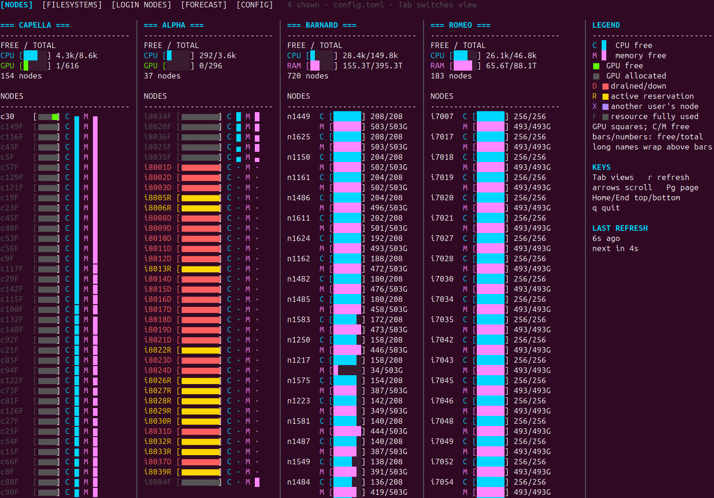
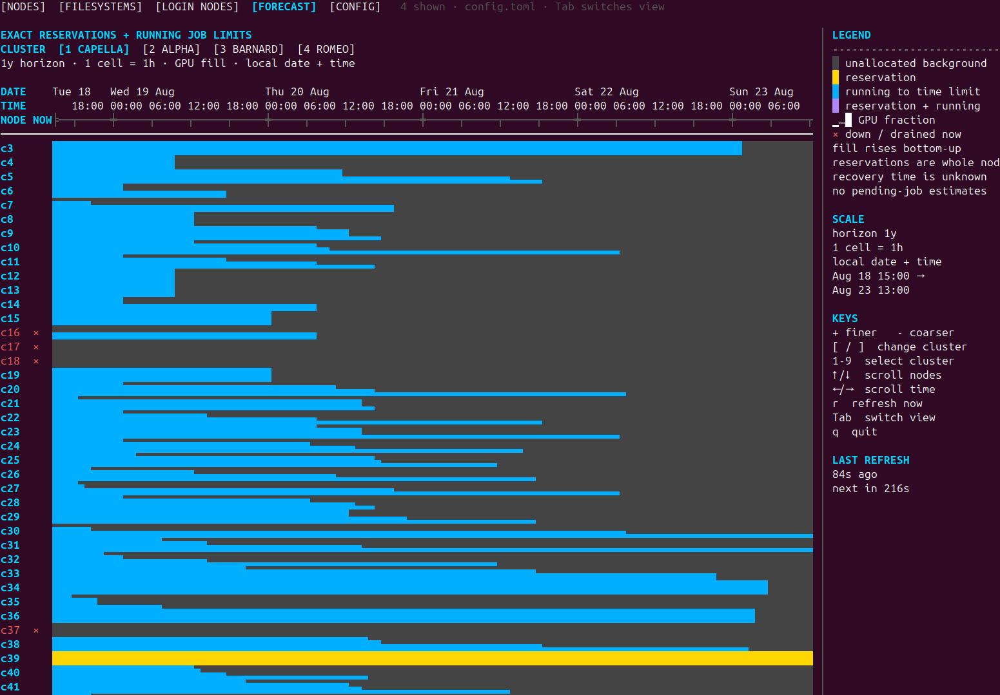

<p align="center">
  
</p>

<p align="center">
  A live, configurable terminal dashboard for multiple Slurm clusters.
</p>

<p align="center">
  <a href="https://github.com/LukasBuschmann/slurm-avail/actions/workflows/ci.yml"></a>
  
  <a href="LICENSE"></a>
</p>

`slurm-avail` brings live CPU, memory, GPU, filesystem, and scheduler data from
multiple Slurm clusters into one keyboard-driven TUI. Clusters can be queried
locally or over SSH. No `slurm-avail` agent or service needs to be installed on
the HPC systems; the dashboard uses their existing Slurm command-line tools.

| Live multi-cluster overview | Scheduler forecast |
| --- | --- |
|  |  |

## Views

**Nodes** gives a live overview of all configured clusters. It summarizes free
CPU, memory, and physical GPU capacity and then shows how those resources are
distributed across individual nodes. Node states such as allocated, reserved,
user-exclusive, drained, and down remain visible in the same view.

**Filesystems** compares capacity and available space for the storage paths
configured on each cluster.

**Login Nodes** shows which SSH endpoints are reachable, which endpoint is
currently supplying data, and whether automatic failover is available.

**Forecast** presents a per-node timeline of exact Slurm reservations and the
remaining time limits of currently running jobs. The timeline can be zoomed
and navigated from short operational windows up to a year. It deliberately
does not speculate about when pending jobs will start.

**Config** manages clusters and dashboard behavior without leaving the TUI.
Clusters can use local or SSH collection, multiple login endpoints, CPU or GPU
focused layouts, custom Slurm locations, and selected filesystem paths. They
can also be hidden or reordered, while refresh and retry intervals are shared
dashboard settings. Everything is persisted in a readable TOML file.

## Installation

Install from PyPI with [`uv`](https://docs.astral.sh/uv/):

```console
uv tool install slurm-avail
slurm-avail
```

[`pipx`](https://pipx.pypa.io/) is also supported:

```console
pipx install slurm-avail
```

The package has no third-party runtime dependencies.

## Quick start

Run:

```console
slurm-avail
```

On first launch, the Config view opens automatically and creates:

```text
~/.config/slurm-avail/config.toml
```

Select the initial local cluster and press `Enter` to edit it, or press `a` to
add an SSH cluster. Press `s` to save and apply, then use `Tab` to switch
between Nodes, Filesystems, Login Nodes, Forecast, and Config.

You can return directly to configuration with:

```console
slurm-avail --init
```

## Configuration

Clusters may run locally or be reached through one or more SSH endpoints.

The following is an example configuration for the **TU Dresden HPC system**.
It monitors the Capella, Alpha, Barnard, and Romeo clusters, including their
two login nodes and shared filesystems. Replace `USERNAME` with your own
TU Dresden/ZIH username.

<details>
<summary>Show TU Dresden HPC example configuration</summary>

```toml
version = 1

[settings]
node_refresh_seconds = 10
filesystem_refresh_seconds = 60
login_refresh_seconds = 60
forecast_refresh_seconds = 300
failed_retry_seconds = 10
ssh_connect_timeout_seconds = 8
command_timeout_seconds = 20
login_probe_timeout_seconds = 10
filesystem_probe_timeout_seconds = 2
retries_per_address = 0
retry_delay_seconds = 1
forecast_horizon_days = 365

[[clusters]]
name = "CAPELLA"
mode = "ssh"
addresses = ["login1.capella.hpc.tu-dresden.de", "login2.capella.hpc.tu-dresden.de"]
user = "USERNAME"
focus = "gpu"
hidden = false
filesystems = ["/home", "/software", "/data/horse", "/data/walrus", "/data/narwhal", "/data/quokka", "/data/cat"]
slurm_bin_path = "/opt/slurm/current/bin"
exclude_partitions = ["interactive", "capella-interactive"]

[[clusters]]
name = "ALPHA"
mode = "ssh"
addresses = ["login1.alpha.hpc.tu-dresden.de", "login2.alpha.hpc.tu-dresden.de"]
user = "USERNAME"
focus = "gpu"
hidden = false
filesystems = ["/home", "/software", "/data/horse", "/data/walrus", "/data/narwhal", "/data/quokka", "/data/cat"]
slurm_bin_path = "/opt/slurm/current/bin"
exclude_partitions = ["interactive", "alpha-interactive"]

[[clusters]]
name = "BARNARD"
mode = "ssh"
addresses = ["login1.barnard.hpc.tu-dresden.de", "login2.barnard.hpc.tu-dresden.de"]
user = "USERNAME"
focus = "cpu"
hidden = false
filesystems = ["/home", "/software", "/data/horse", "/data/walrus", "/data/narwhal", "/data/quokka", "/data/cat"]
slurm_bin_path = "/opt/slurm/current/bin"
exclude_partitions = ["interactive"]

[[clusters]]
name = "ROMEO"
mode = "ssh"
addresses = ["login1.romeo.hpc.tu-dresden.de", "login2.romeo.hpc.tu-dresden.de"]
user = "USERNAME"
focus = "cpu"
hidden = false
filesystems = ["/home", "/software", "/data/horse", "/data/walrus", "/data/narwhal", "/data/quokka", "/data/cat"]
slurm_bin_path = "/opt/slurm/current/bin"
exclude_partitions = ["interactive"]
```

</details>

For a smaller generic example, see [config.example.toml](config.example.toml).
The `user` field is optional; when omitted, OpenSSH configuration determines
the user. The Slurm path is also optional when `scontrol` and `squeue` are
already available on the endpoint's `PATH`.

A different configuration file can be selected with:

```console
slurm-avail --config /path/to/config.toml
```

`XDG_CONFIG_HOME` is respected.

## Controls

| Key | Action |
| --- | --- |
| `Tab` | Switch view |
| Arrow keys | Scroll or navigate |
| `Page Up` / `Page Down` | Scroll by page |
| `Home` / `End` | Jump to top or bottom |
| `r` | Refresh now |
| `+` / `-` | Change forecast resolution |
| `[` / `]` | Change forecast cluster |
| `q` | Quit |

The Config view shows its editing controls in the legend. In particular, use
`a` to add, `Enter` to edit, `h` to hide or show, `Shift+Up/Down` to reorder,
and `s` to save clusters.

## Requirements

On the computer running `slurm-avail`:

- Python 3.11 or newer
- a curses-capable POSIX terminal
- OpenSSH's `ssh` command for remote clusters

On each configured cluster endpoint:

- a working Slurm installation connected to the cluster controller
- Slurm's `scontrol` and `squeue` commands available on `PATH` or through the
  configured `slurm_bin_path`
- `/bin/sh`, `id`, and `date`
- `df` and `tail` for filesystem monitoring (`timeout` is used when present)

SSH authentication must already work non-interactively, normally through an
SSH agent, keys, and `~/.ssh/config`. `slurm-avail` does not store passwords or
private keys.

## Command-line usage

```console
slurm-avail --help
slurm-avail --version
slurm-avail --once
slurm-avail --view forecast --cluster 2
```

## Development

```console
git clone https://github.com/LukasBuschmann/slurm-avail.git
cd slurm-avail
python -m venv .venv
. .venv/bin/activate
python -m pip install -e '.[dev]'
pytest
ruff check .
```

Contributions and issue reports are welcome. Release instructions are in
[RELEASING.md](RELEASING.md).

## License

`slurm-avail` is available under the [MIT License](LICENSE).
